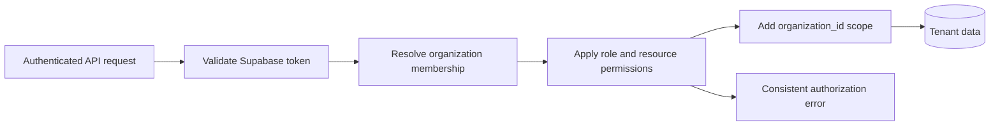

# Authorization and Tenant-Isolation Diagram

```mermaid
flowchart LR
  Request[Authenticated API request] --> Identity[Validate Supabase token]
  Identity --> Membership[Resolve organization membership]
  Membership --> Role[Apply role and resource permissions]
  Role --> Scope[Add organization_id scope]
  Scope --> Data[(Tenant data)]
  Role --> Deny[Consistent authorization error]
```
