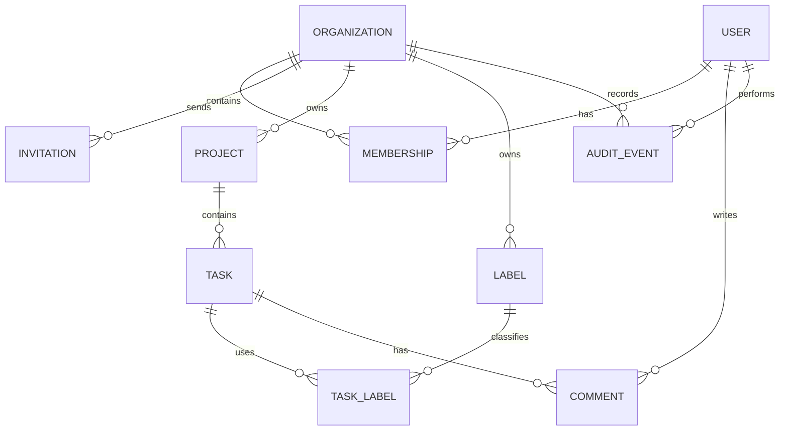

# Initial Domain Diagram

```mermaid
erDiagram
  USER ||--o{ MEMBERSHIP : has
  ORGANIZATION ||--o{ MEMBERSHIP : contains
  ORGANIZATION ||--o{ INVITATION : sends
  ORGANIZATION ||--o{ PROJECT : owns
  PROJECT ||--o{ TASK : contains
  ORGANIZATION ||--o{ LABEL : owns
  TASK ||--o{ TASK_LABEL : uses
  LABEL ||--o{ TASK_LABEL : classifies
  TASK ||--o{ COMMENT : has
  USER ||--o{ COMMENT : writes
  ORGANIZATION ||--o{ AUDIT_EVENT : records
  USER ||--o{ AUDIT_EVENT : performs
```
